Данный проект является тестовым заданием к отбору на стажировку в Авито.

Методы запуска проекта:
Файл запуска находится в cmd/app
1.  $ go build -o app ./cmd/app
    $ ./app
2.  Запуск Makefile

Используемые фреймворки:
1.  github.com/lib/pq
2.  github.com/redis/go-redis/v9
3.  github.com/gin-gonic/gin
Также использовались пакеты из стандартной библиотеки

Примеры запросов к сервису через Postman:
1.  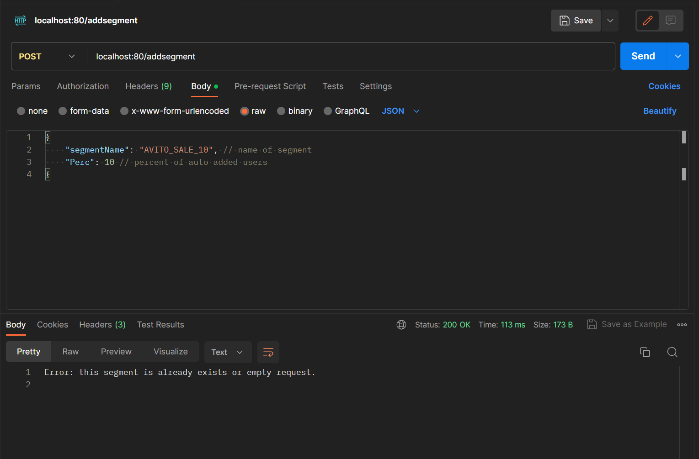
2.  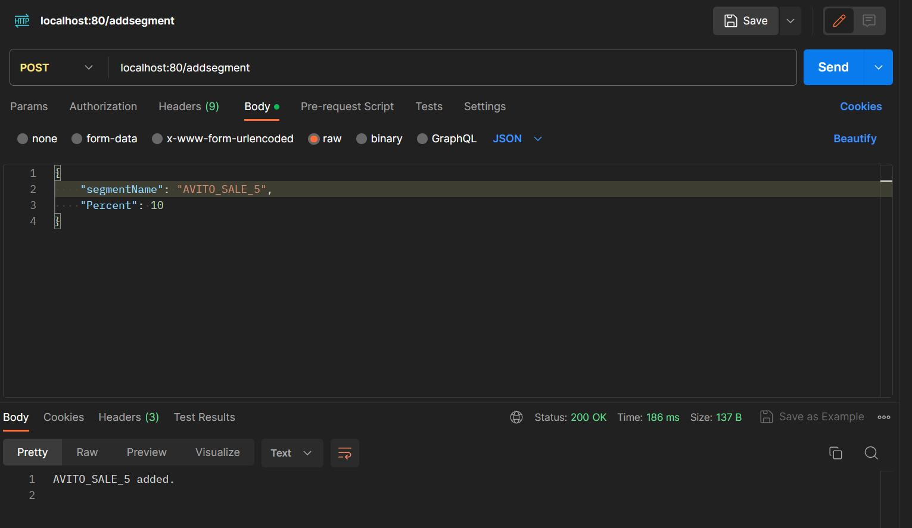
3.  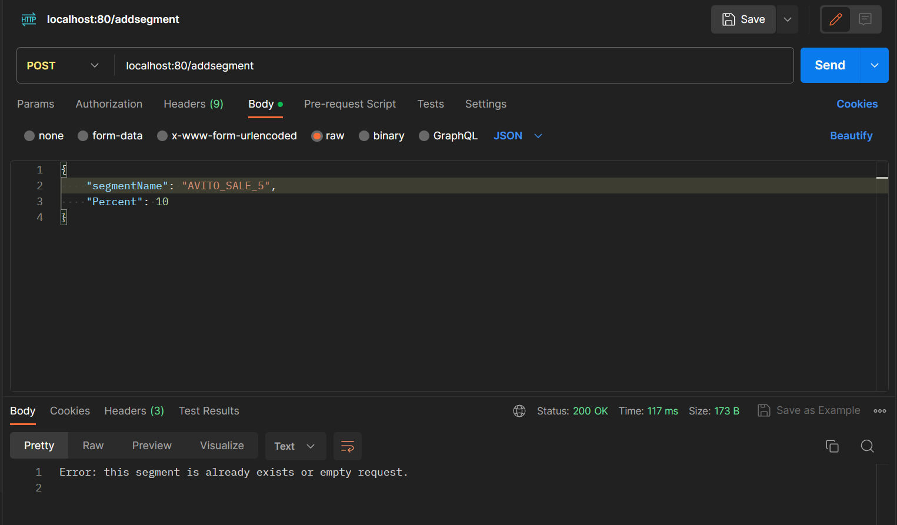
4.  
5.  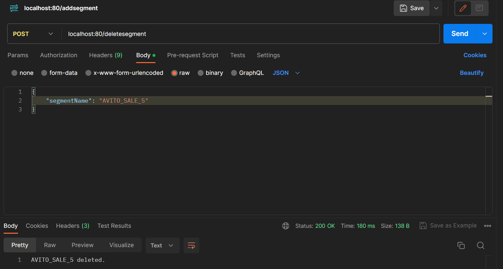
6.  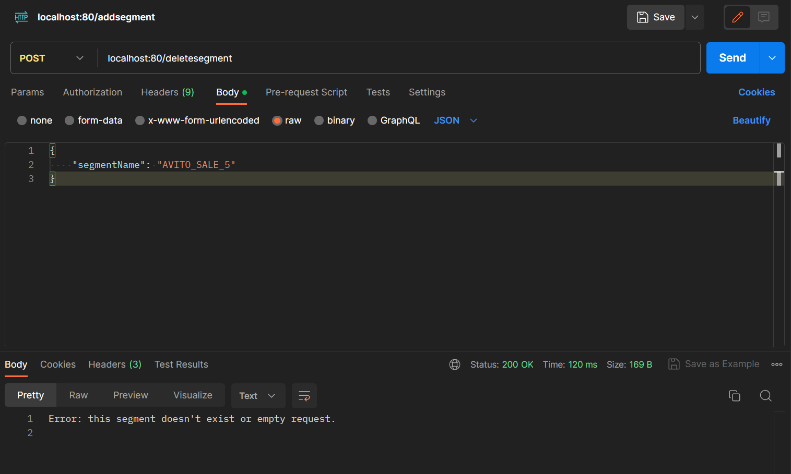
7.  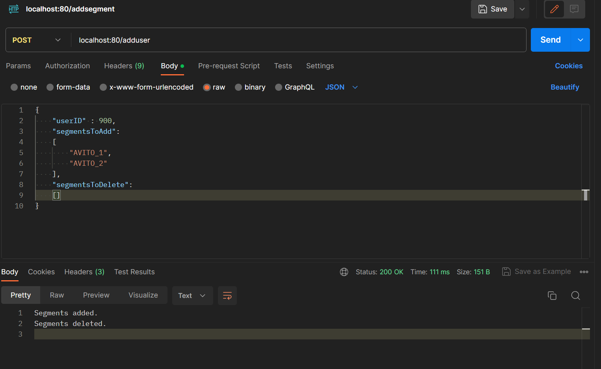
8.  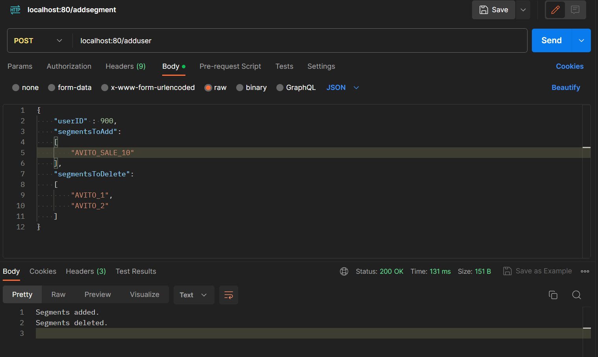
9.  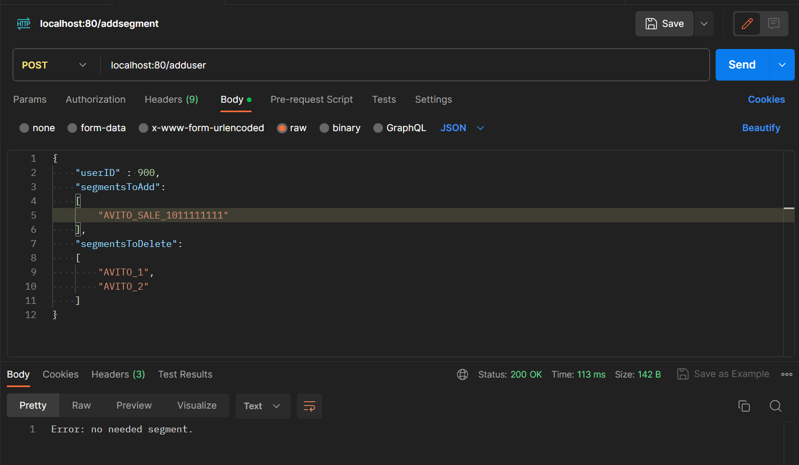
10. 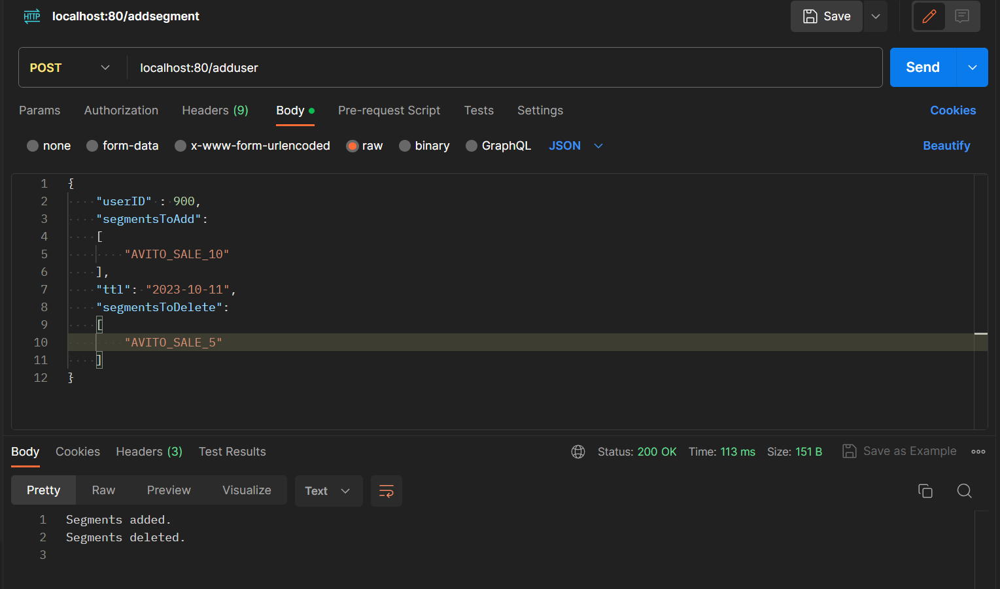
11. 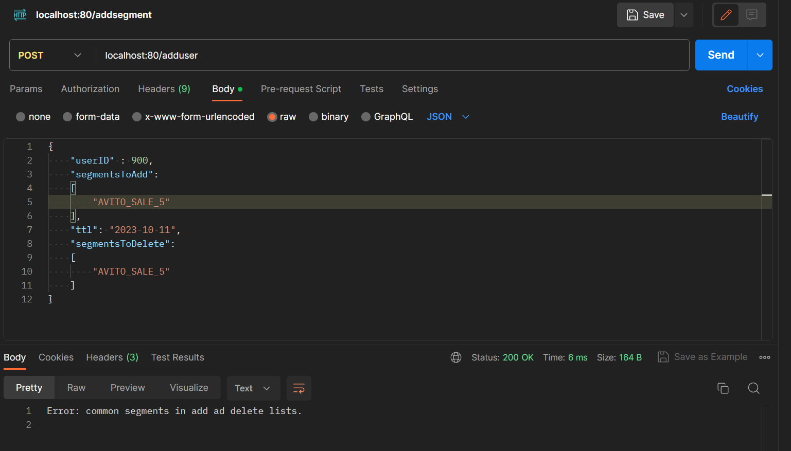
12. 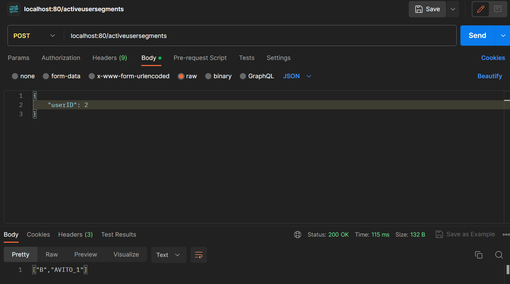
13. 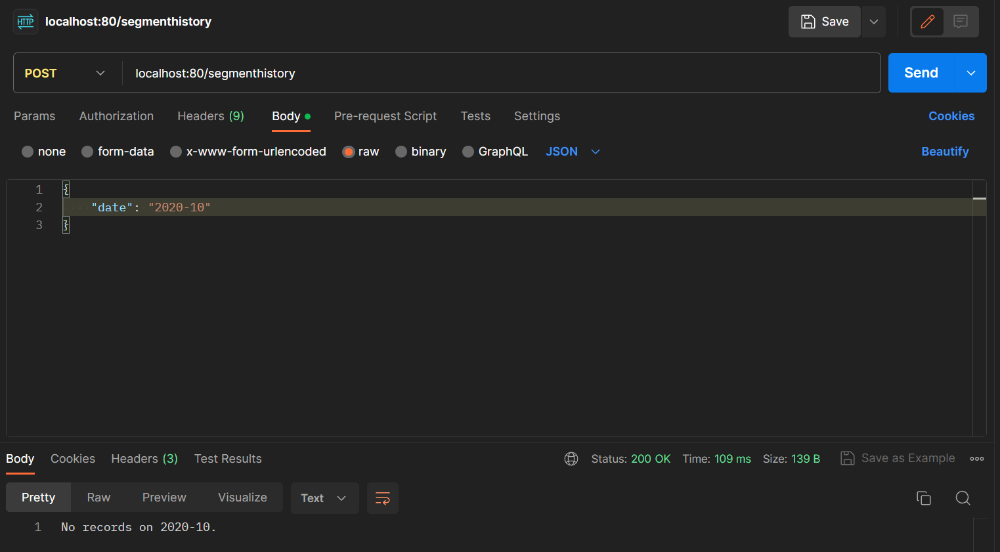
14. 
15. 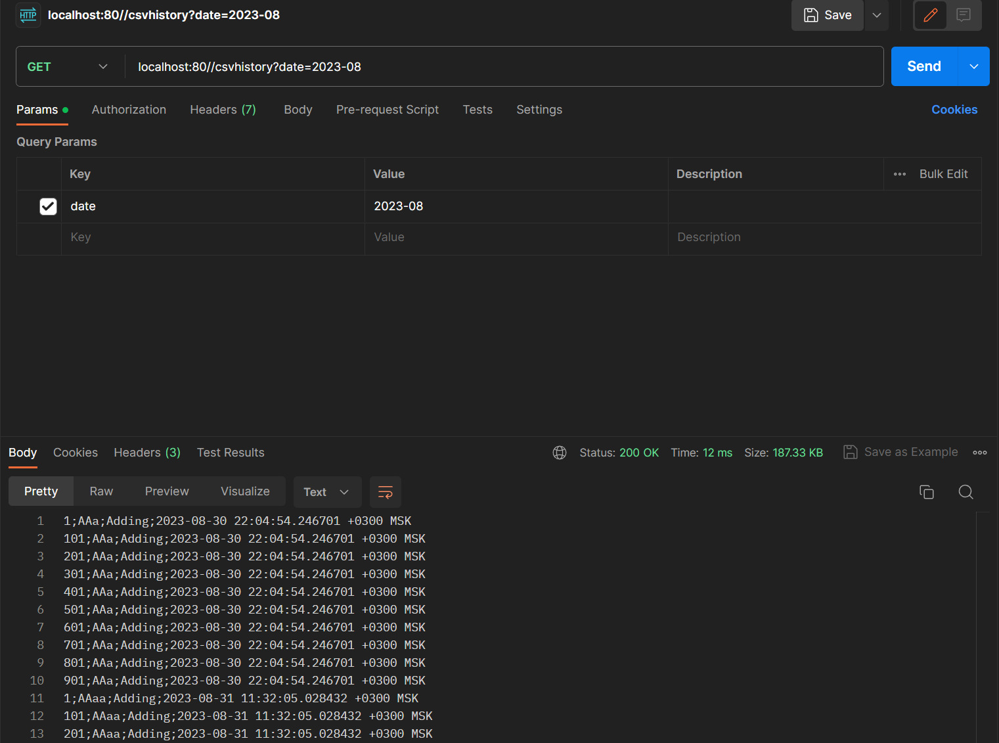
16. 

База данных:
    users - список пользователей
    segments - список сегментов
    user_segments - список сегментов пользователей, где каждая запись - пользователь и сегмент, в котором он состоит
    segment_history - история добавления и удаления пользователей в сегмент

Дополнительные задания:
1.  Реализовано в методе /segmenthistory и /csvhistory. Проводится поиск по записям в таблице segment_history на              совпадение даты с введенной. Возвращается url, в котором хранится сохраненный файл в формате .csv. Запрос на данный адрес возвращает этот файл.   
2.  Реализована горутина (checkTTL), которая в отдельном потоке проверяет дату автоматического удаления из таблицы user_segments на совпадение с текущeй датой. При успехе удаляет эти строки, иначе только "засыпает" на сутки.
3.  Реализовано в методе добавления сегмента через набор случайных(насколько позволяет math/rand) пользователей
    и последующем их добавлении в сегмент.
