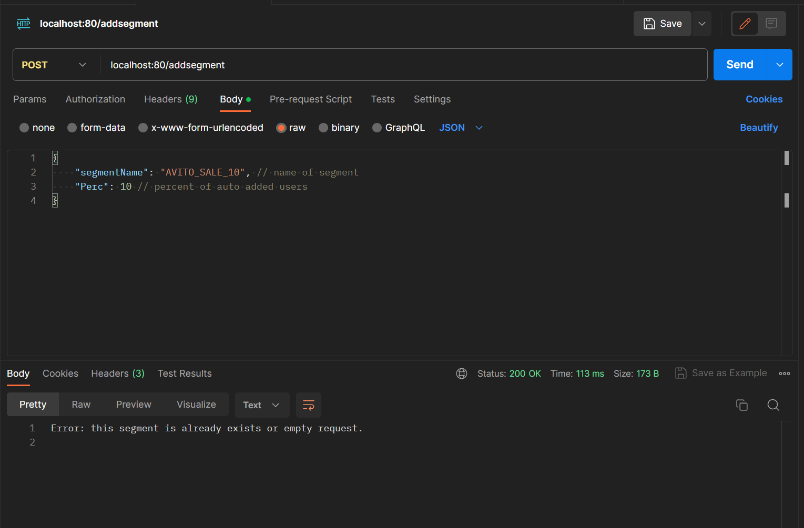

Данный проект является тестовым заданием к отбору на стажировку в Авито.

Методы запуска проекта:
1.  $ go build -o start.exe ./cmd/app
    $ ./start
2.  Запуск Makefile
3.  docker run

Примеры запросов к сервису через Postman:
1.  Request:
        POST
        localhost:80/addsegment
        {
        "segmentName": "AVITO_SALE_10", // name of segment
        "Perc": 10  // percent of auto added users
        }
    Response:
        Error: this segment is already exists or empty request.
2.  Request:
        POST
        localhost:80/addsegment
        {
        "segmentName": "AVITO_SALE_20", // name of segment
        "Perc": 10  // percent of auto added users
        }
    Response:
        AVITO_SALE_20 added.
3.  Request:
        POST
        localhost:80/addsegment
        {
        "Perc": 10  // percent of auto added users
        }
    Response:
        Error: this segment is already exists or empty request.
4.  Request:
        POST
        localhost:80/deletesegment
        {
            "segmentName": "AVITO_SALE_20" // name of segment
        }  
    Response:
        Error: this segment doesn't exist or empty request.
5.  Request:
        POST
        localhost:80/deletesegment
        {
            "segmentName": "AVITO_SALE_30" // name of segment
        }  
    Response:
        Error: this segment doesn't exist or empty request.
6.  Request:
        POST
        localhost:80/deletesegment
        {
            "segmentName": "AVITO_SALE_20" // name of segment
        }  
    Response:
        AVITO_SALE_20 deleted.
7.  Request:
        POST
        localhost:80/adduser
        {
            "segmentName": "AVITO_SALE_30" // name of segment
        }  
    Response:
        Error: this segment doesn't exist or empty request.
8.  Request:
        POST
        localhost:80/adduser
        {
            "userID": 1, // user id
            "segmentsToAdd":
            [
                "AVITO_SALE_50",
                "AVITO_BAN"
            ],
            "segmentsToDelete":
            [
                "AVITO_BAN"
            ]
        }
    Response:
        Error: common segments in add ad delete lists.
9. Request:
        POST
        localhost:80/adduser
        {
            "userID": 1, // user id
            "segmentsToAdd":
            [
                "AVITO_SALE_50",
                "AVITO_BAN"
            ],
            "segmentsToDelete":
            [
                "AVITO_BAN"
            ]
        }
    Response:
        Error: common segments in add ad delete lists.
